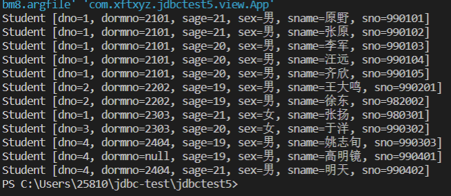

# 《数据库课程设计》实验报告

> 学号：2020118100  姓名：庞晓宇


## 一、实验名称
第10次实习作业


## 二、实验目的
掌握使用Java连接数据库的方法


## 三、实验内容
作业十二:利用Java尝试连接数据库  
自行查找资料，利用Java尝试连接Stu，并访问其中的数据


## 四、实验最后的思考
经过本次实验，学习了使用Java链接数据库，使用了JDBC创建连接。

新建maven Java项目，添加相关依赖。

编写JDBC工具类，用于获取和关闭连接：
```java
package com.xftxyz.jdbctest5.util;

import java.io.IOException;
import java.io.InputStream;
import java.sql.Connection;
import java.sql.DriverManager;
import java.sql.SQLException;
import java.util.Properties;

public class JDBC {
    // 获取链接
    public static Connection getConnection() throws IOException, ClassNotFoundException, SQLException {
        // 1.加载配置文件
        InputStream is = JDBC.class.getClassLoader().getResourceAsStream("jdbc.properties");
        Properties pros = new Properties();
        pros.load(is);

        // 2.读取配置信息
        String user = pros.getProperty("user");
        String password = pros.getProperty("password");
        String url = pros.getProperty("url");
        String driverClass = pros.getProperty("driverClass");
        // System.out.println(user + " " + password + " " + url + " " + driverClass);
        // 3.加载驱动
        Class.forName(driverClass);

        // 4.获取连接
        Connection conn = DriverManager.getConnection(url, user, password);
        return conn;
    }

    // 关闭链接
    public static void closeConnection(Connection conn) throws SQLException {
        if (conn != null) {
            conn.close();
        }
    }
}
```

使用dbutils辅助实现BaseDao类：
```java
package com.xftxyz.jdbctest5.dao;

import java.lang.reflect.ParameterizedType;
import java.lang.reflect.Type;
import java.sql.Connection;
import java.sql.SQLException;
import java.util.List;

import org.apache.commons.dbutils.QueryRunner;
import org.apache.commons.dbutils.handlers.BeanHandler;
import org.apache.commons.dbutils.handlers.BeanListHandler;
import org.apache.commons.dbutils.handlers.ScalarHandler;

/**
 * 定义一个用来被继承的对数据库进行基本操作的Dao
 */
public abstract class BaseDao<T> {
    private QueryRunner queryRunner = new QueryRunner();
    // 定义一个变量来接收泛型的类型
    private Class<T> type;

    // 获取T的Class对象，获取泛型的类型，泛型是在被子类继承时才确定
    public BaseDao() {
        // 获取子类的类型
        // 下面的这个this是其子类对象的引用，创建子类虽然调用了父类的构造方法但是并没有创建父类对象
        Class clazz = this.getClass();
        // 获取父类的类型
        // getGenericSuperclass()用来获取当前类的父类的类型
        // ParameterizedType表示的是带泛型的类型
        ParameterizedType parameterizedType = (ParameterizedType) clazz.getGenericSuperclass();
        // 获取具体的泛型类型 getActualTypeArguments获取具体的泛型的类型
        // 这个方法会返回一个Type的数组
        Type[] types = parameterizedType.getActualTypeArguments();
        // 获取具体的泛型的类型·
        this.type = (Class<T>) types[0];
    }

    /**
     * 通用的增删改操作
     */
    public int update(Connection conn, String sql, Object... params) {
        int count = 0;
        try {
            count = queryRunner.update(conn, sql, params);
        } catch (SQLException e) {
            e.printStackTrace();
        }
        return count;
    }

    /**
     * 获取一个对象
     */
    public T getBean(Connection conn, String sql, Object... params) {
        T t = null;
        try {
            t = queryRunner.query(conn, sql, new BeanHandler<T>(type), params);
        } catch (SQLException e) {
            e.printStackTrace();
        }
        return t;
    }

    /**
     * 获取所有对象
     */
    public List<T> getBeanList(Connection conn, String sql, Object... params) {
        List<T> list = null;
        try {
            list = queryRunner.query(conn, sql, new BeanListHandler<T>(type), params);
        } catch (SQLException e) {
            e.printStackTrace();
        }
        return list;
    }

    /**
     * 获取一个但一值得方法，专门用来执行像 select count(*)...这样的sql语句
     */
    public Object getValue(Connection conn, String sql, Object... params) {
        Object count = null;
        try {
            // 调用queryRunner的query方法获取一个单一的值
            count = queryRunner.query(conn, sql, new ScalarHandler<>(), params);
        } catch (SQLException e) {
            e.printStackTrace();
        }
        return count;
    }
}
```

编写相应的java bean：
eg.Student表（关系）对应的java bean：
```java
package com.xftxyz.jdbctest5.domain;

public class Student {
    private String sno;
    private String sname;
    private String sex;
    private Integer sage;
    private String dno;
    private String dormno;

    public Student(String sno, String sname, String sex, Integer sage, String dno, String dormno) {
        this.sno = sno;
        this.sname = sname;
        this.sex = sex;
        this.sage = sage;
        this.dno = dno;
        this.dormno = dormno;
    }

    public Student() {
    }

    public String getSno() {
        return sno;
    }

    public void setSno(String sno) {
        this.sno = sno;
    }

    public String getSname() {
        return sname;
    }

    public void setSname(String sname) {
        this.sname = sname;
    }

    public String getSex() {
        return sex;
    }

    public void setSex(String sex) {
        this.sex = sex;
    }

    public Integer getSage() {
        return sage;
    }

    public void setSage(Integer sage) {
        this.sage = sage;
    }

    public String getDno() {
        return dno;
    }

    public void setDno(String dno) {
        this.dno = dno;
    }

    public String getDormno() {
        return dormno;
    }

    public void setDormno(String dormno) {
        this.dormno = dormno;
    }

    @Override
    public String toString() {
        return "Student [dno=" + dno + ", dormno=" + dormno + ", sage=" + sage + ", sex=" + sex + ", sname=" + sname
                + ", sno=" + sno + "]";
    }

}
```

编写相关的DAO（接口）和DAOImpl（继承BaseDao抽象类，实现对应的dao接口）。

程序主要逻辑中如下操作：
```java
// 获取数据库连接
try {
    conn = JDBC.getConnection();
} catch (ClassNotFoundException | IOException | SQLException e) {
    System.err.println("获取链接失败");
    e.printStackTrace();
    return;
}

// 创建相应的dao对象
// 根据程序逻辑，实现相关对应操作

// 关闭数据库连接，释放资源
try {
    JDBC.closeConnection(conn);
} catch (SQLException e) {
    System.err.println("关闭链接失败");
    e.printStackTrace();
}
```

尝试获取student表中的数据并打印：

其实现依靠下面的代码
```java
public class StudentDaoImpl extends BaseDao<Student> implements StudentDao {

    @Override
    public List<Student> getStudents(Connection conn) {
        return getBeanList(conn, "select * from student");
    }

    ...
}
```

之后，更多数据库相关操作只需编写相对应的bean、dao和daoimpl即可。
