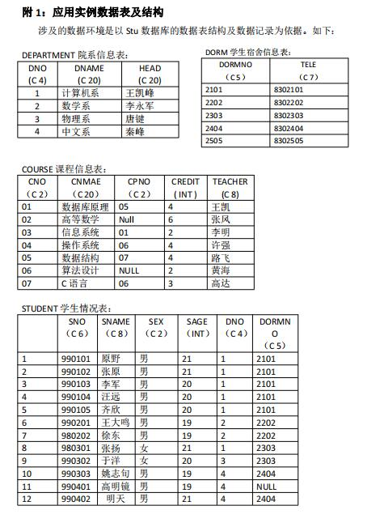
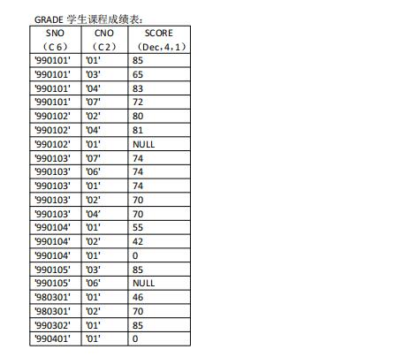
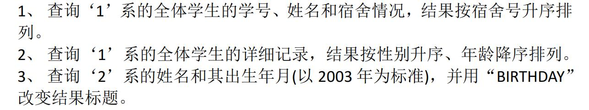
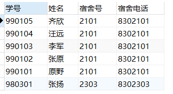
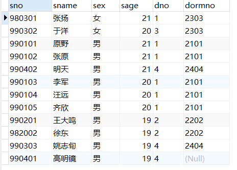
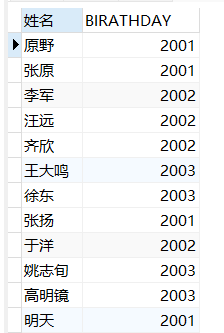

# 《数据库课程设计》实验报告
> 学号：2020118100  姓名：庞晓宇


## 一、实验名称
第二次实习作业


## 二、实验目的
1. 尝试建立附录一给的数据库Stu(后面的作业均在此数据库基础上完成)，建立其中的关系，并录入数据。
    

    
2. 在以上建立的数据库上完成下列查询
    


## 三、实验内容

### 尝试建立附录一给的数据库Stu(后面的作业均在此数据库基础上完成)，建立其中的关系，并录入数据。
创建代码如下
```sql
DROP TABLE IF EXISTS `course`;
CREATE TABLE `course`  (
  `cno` char(2) CHARACTER SET utf8mb4 COLLATE utf8mb4_0900_ai_ci NULL DEFAULT NULL,
  `cname` char(20) CHARACTER SET utf8mb4 COLLATE utf8mb4_0900_ai_ci NULL DEFAULT NULL,
  `cpno` char(2) CHARACTER SET utf8mb4 COLLATE utf8mb4_0900_ai_ci NULL DEFAULT NULL,
  `credit` int NULL DEFAULT NULL,
  `teacher` char(8) CHARACTER SET utf8mb4 COLLATE utf8mb4_0900_ai_ci NULL DEFAULT NULL
) ENGINE = InnoDB CHARACTER SET = utf8mb4 COLLATE = utf8mb4_0900_ai_ci ROW_FORMAT = Dynamic;

```

```sql
INSERT INTO `course` VALUES ('01', '数据库原理', '05', 4, '王凯');
INSERT INTO `course` VALUES ('02', '高等数学', NULL, 6, '张风');
INSERT INTO `course` VALUES ('03', '信息系统', '01', 2, '李明');
INSERT INTO `course` VALUES ('04', '操作系统', '06', 4, '许强');
INSERT INTO `course` VALUES ('05', '数据结构', '07', 4, '路飞');
INSERT INTO `course` VALUES ('06', '算法设计', NULL, 2, '黄海');
INSERT INTO `course` VALUES ('07', 'C语言', '06', 3, '高达');
```

```sql
DROP TABLE IF EXISTS `department`;
CREATE TABLE `department`  (
  `dno` char(4) CHARACTER SET utf8mb4 COLLATE utf8mb4_0900_ai_ci NULL DEFAULT NULL,
  `dname` char(20) CHARACTER SET utf8mb4 COLLATE utf8mb4_0900_ai_ci NULL DEFAULT NULL,
  `head` char(20) CHARACTER SET utf8mb4 COLLATE utf8mb4_0900_ai_ci NULL DEFAULT NULL
) ENGINE = InnoDB CHARACTER SET = utf8mb4 COLLATE = utf8mb4_0900_ai_ci ROW_FORMAT = Dynamic;
```

```sql
INSERT INTO `department` VALUES ('1', '计算机系', '王凯峰');
INSERT INTO `department` VALUES ('2', '数学系', '李永军');
INSERT INTO `department` VALUES ('3', '物理系', '唐建');
INSERT INTO `department` VALUES ('4', '中文系', '秦峰');
```

```sql
DROP TABLE IF EXISTS `dorm`;
CREATE TABLE `dorm`  (
  `dormno` char(5) CHARACTER SET utf8mb4 COLLATE utf8mb4_0900_ai_ci NULL DEFAULT NULL,
  `tele` char(7) CHARACTER SET utf8mb4 COLLATE utf8mb4_0900_ai_ci NULL DEFAULT NULL
) ENGINE = InnoDB CHARACTER SET = utf8mb4 COLLATE = utf8mb4_0900_ai_ci ROW_FORMAT = Dynamic;
```

```sql
INSERT INTO `dorm` VALUES ('2101', '8302101');
INSERT INTO `dorm` VALUES ('2202', '8302202');
INSERT INTO `dorm` VALUES ('2303', '8302303');
INSERT INTO `dorm` VALUES ('2404', '8302404');
INSERT INTO `dorm` VALUES ('2505', '8302505');
```

```sql
DROP TABLE IF EXISTS `grade`;
CREATE TABLE `grade`  (
  `sno` char(6) CHARACTER SET utf8mb4 COLLATE utf8mb4_0900_ai_ci NULL DEFAULT NULL,
  `cno` char(2) CHARACTER SET utf8mb4 COLLATE utf8mb4_0900_ai_ci NULL DEFAULT NULL,
  `score` decimal(4, 1) NULL DEFAULT NULL
) ENGINE = InnoDB CHARACTER SET = utf8mb4 COLLATE = utf8mb4_0900_ai_ci ROW_FORMAT = Dynamic;
```

```sql
INSERT INTO `grade` VALUES ('990101', '01', 85.0);
INSERT INTO `grade` VALUES ('990101', '03', 65.0);
INSERT INTO `grade` VALUES ('990101', '04', 83.0);
INSERT INTO `grade` VALUES ('990101', '07', 72.0);
INSERT INTO `grade` VALUES ('990102', '02', 80.0);
INSERT INTO `grade` VALUES ('990102', '04', 81.0);
INSERT INTO `grade` VALUES ('990102', '01', NULL);
INSERT INTO `grade` VALUES ('990103', '07', 74.0);
INSERT INTO `grade` VALUES ('990103', '06', 74.0);
INSERT INTO `grade` VALUES ('990103', '01', 74.0);
INSERT INTO `grade` VALUES ('990103', '02', 70.0);
INSERT INTO `grade` VALUES ('990103', '04', 70.0);
INSERT INTO `grade` VALUES ('990104', '01', 55.0);
INSERT INTO `grade` VALUES ('990104', '02', 42.0);
INSERT INTO `grade` VALUES ('990104', '01', 0.0);
INSERT INTO `grade` VALUES ('990105', '03', 85.0);
INSERT INTO `grade` VALUES ('990105', '06', NULL);
INSERT INTO `grade` VALUES ('980301', '01', 46.0);
INSERT INTO `grade` VALUES ('980301', '02', 70.0);
INSERT INTO `grade` VALUES ('990302', '01', 85.0);
INSERT INTO `grade` VALUES ('990401', '01', 0.0);
```

```sql
DROP TABLE IF EXISTS `student`;
CREATE TABLE `student`  (
  `sno` char(6) CHARACTER SET utf8mb4 COLLATE utf8mb4_0900_ai_ci NULL DEFAULT NULL,
  `sname` char(8) CHARACTER SET utf8mb4 COLLATE utf8mb4_0900_ai_ci NULL DEFAULT NULL,
  `sex` char(2) CHARACTER SET utf8mb4 COLLATE utf8mb4_0900_ai_ci NULL DEFAULT NULL,
  `sage` int NULL DEFAULT NULL,
  `dno` char(4) CHARACTER SET utf8mb4 COLLATE utf8mb4_0900_ai_ci NULL DEFAULT NULL,
  `dormno` char(5) CHARACTER SET utf8mb4 COLLATE utf8mb4_0900_ai_ci NULL DEFAULT NULL
) ENGINE = InnoDB CHARACTER SET = utf8mb4 COLLATE = utf8mb4_0900_ai_ci ROW_FORMAT = Dynamic;
```

```sql
INSERT INTO `student` VALUES ('990101', '原野', '男', 21, '1', '2101');
INSERT INTO `student` VALUES ('990102', '张原', '男', 21, '1', '2101');
INSERT INTO `student` VALUES ('990103', '李军', '男', 20, '1', '2101');
INSERT INTO `student` VALUES ('990104', '汪远', '男', 20, '1', '2101');
INSERT INTO `student` VALUES ('990105', '齐欣', '男', 20, '1', '2101');
INSERT INTO `student` VALUES ('990201', '王大鸣', '男', 19, '2', '2202');
INSERT INTO `student` VALUES ('982002', '徐东', '男', 19, '2', '2202');
INSERT INTO `student` VALUES ('980301', '张扬', '女', 21, '1', '2303');
INSERT INTO `student` VALUES ('990302', '于洋', '女', 20, '3', '2303');
INSERT INTO `student` VALUES ('990303', '姚志旬', '男', 19, '4', '2404');
INSERT INTO `student` VALUES ('990401', '高明镜', '男', 19, '4', NULL);
INSERT INTO `student` VALUES ('990402', '明天', '男', 21, '4', '2404');
```

### 几条简单的查询
```sql
-- 查询‘1’系的全体学生的学号、姓名和宿舍情况，结果按宿舍号升序排列。
SELECT sno "学号", sname "姓名", s.dormno "宿舍号", tele "宿舍电话"
FROM student s, dorm d WHERE s.dormno = d.dormno AND dno = '1' ORDER BY s.dormno ASC;

-- 查询‘1’系 全体学生的详细记录，结果按性别升序、年龄降序排列。
SELECT * FROM student
ORDER BY sex ASC, sage DESC;

-- 查询‘2’系的姓名以及出生年月（以2003年为标准），并用“BIRATHDAY”改变结果标题
SELECT sname "姓名", YEAR(NOW())-sage "BIRATHDAY"
FROM student;
```








## 四、实验最后的思考
通过本次实验，复习了数据库的基本使用，如创建数据库、创建表。复习了create、select语句的使用，根据所给数据建立了相应的数据库和表并插入了数据，在此基础上完成了相应的查询。

思考1：恢复空值。  
如果直接在表内容的可视化编辑中使用退格键删除，那么该条记录当前数据域的值会变为空字符串而不是（NULL）。
如果要恢复其空值应使用
```sql
UPDATE 表名 set 字段名 = null where 行筛选条件;
```

思考2：码、候选码、主码的关系。  
主码是记录的唯一标识、候选码是可以作为主码的码，主码一定是候选码的子集，但候选码不一定是主码。
主码是被数据库设计者选中的，用来在同一实体集中区分不同实体的候选码，主码应具有不变或极少变化的属性。
码可以是属性或属性组，但属性组中不能含有多余的属性。
当实体集中含多个码时，选定其中一个码作为主码，其他的码就是候选码。
