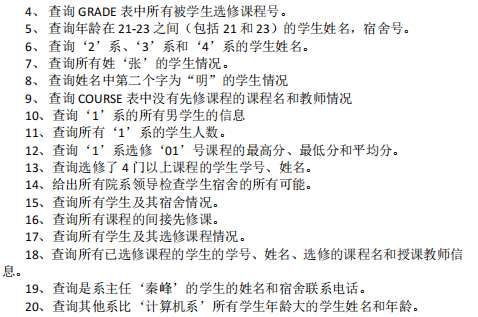
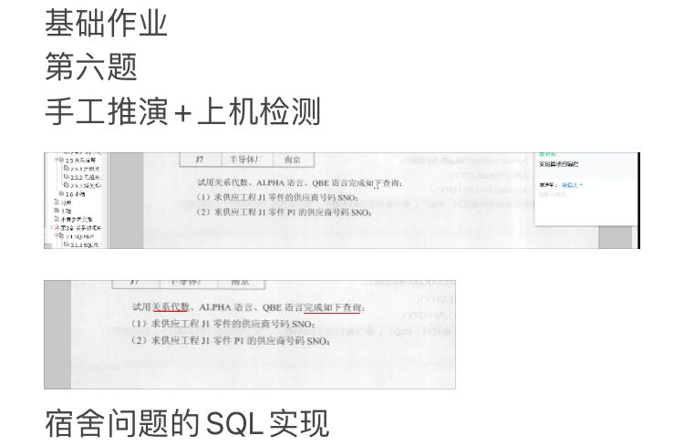

# 《数据库课程设计》实验报告

> 学号：2020118100  姓名：庞晓宇


## 一、实验名称
数据库课程设计第3次上机实验


## 二、实验目的
1. 
2. 
3. 


## 三、实验内容
4. 查询GRADE表中所有被学生选修课程号。
```sql
SELECT DISTINCT cno FROM grade;
```

5. 查询年龄在21-23之间(包括21和23）的学生姓名，宿舍号。
```sql
SELECT sname, dormno FROM student
WHERE sage BETWEEN 21 AND 23;
```

6. 查询‘2’系、‘3’系和‘4’系的学生姓名。
```sql
SELECT sname FROM student
WHERE dno IN('2', '3', '4');
```

7. 查询所有姓‘张’的学生情况。
```sql
SELECT * FROM student
WHERE sname LIKE '张%';
```

8. 查询姓名中第二个字为“明”的学生情况
```sql
SELECT * FROM student
WHERE sname LIKE '_明%';
```

9. 查询COURSE表中没有先修课程的课程名和教师情况
```sql
SELECT cname, teacher FROM course
WHERE cpno IS NULL;
```

10. 查询‘1’系的所有男学生的信息
```sql
SELECT * FROM student
WHERE sex = '男' AND dno = '1';
```

11. 查询所有‘1’系的学生人数。
```sql
SELECT COUNT(*) FROM student
WHERE dno = '1';
```

12. 查询‘1’系选修‘01’号课程的最高分、最低分和平均分。
```sql
SELECT MAX(score), MIN(score), AVG(score) FROM grade g
JOIN student s ON s.sno = g.sno
WHERE s.dno = '1' AND g.cno = '01';
```

13. 查询选修了4门以上课程的学生学号、姓名。
```sql
SELECT sno, sname FROM student
WHERE sno IN(
	SELECT sno FROM grade
	GROUP BY sno
	HAVING COUNT(*) > 4
);
```

14. 给出所有院系领导检查学生宿舍的所有可能。
```sql
SELECT * FROM dorm d, department de;
```

15. 查询所有学生及其宿舍情况。
```sql
SELECT sno, sname, sex, sage, dno, s.dormno, tele FROM student s
LEFT JOIN dorm d ON s.dormno = d.dormno;
```

16. 查询所有课程的间接先修课。
```sql
SELECT * FROM course c1
LEFT JOIN course c2 ON c1.cpno = c2.cno;
```

17. 查询所有学生及其选修课程情况。
```sql
SELECT s.sno, s.sname, s.sex, s.dno, s.dormno, c.cno, c.cname, c.cpno, c.credit, c.teacher FROM student s
LEFT JOIN grade g ON s.sno = g.sno
LEFT JOIN course c ON c.cno = g.cno;
```

18. 查询所有已选修课程的学生的学号、姓名、选修的课程名和授课教师信息。
```sql
SELECT s.sno, s.sname, c.cname, c.teacher
FROM grade g
JOIN student s ON g.sno = s.sno
JOIN course c ON g.cno = c.cno;
```

19. 查询是系主任‘秦峰’的学生的姓名和宿舍联系电话。
```sql
SELECT sname, tele FROM student s
LEFT JOIN dorm d ON s.dormno = d.dormno
WHERE dno = (
	SELECT dno FROM department WHERE head = '秦峰'
);
```

20. 查询其他系比‘计算机系’所有学生年龄大的学生姓名和年龄。
```sql
SELECT sname, sage FROM student
WHERE sage > (
	SELECT MAX(sage) FROM student WHERE dno = (
		SELECT dno FROM department WHERE dname = '计算机系'
	)
);
```

### 讨论：学生和宿舍的关系
1. 查询所有学生和宿舍的住宿可能性
```sql
SELECT sno, sname, s.dormno
FROM student s, dorm d;

SELECT * FROM student, dorm;

SELECT COUNT(*) FROM student, dorm;
```

2. 查询住宿学生的住宿情况
```sql
SELECT sno, sname, sex, sage, dno, d.dormno, tele FROM student s, dorm d
WHERE s.dormno = d.dormno;
```

3. 查询所有学生的住宿情况
```sql
SELECT sno, sname, sex, sage, dno, d.dormno, tele FROM student s, dorm d
WHERE s.dormno *= d.dormno;
```

```sql
SELECT sno, sname, sex, sage, dno, d.dormno, tele FROM student s
LEFT JOIN dorm d ON s.dormno = d.dormno;
```

4. 查询学生的住宿的宿舍情况
```sql
SELECT d.dormno, tele, sno, sname, sex, sage, dno FROM dorm d, student s
WHERE s.dormno = d.dormno;
```

5. 查询未住宿的宿舍情况
```sql
SELECT dormno FROM student
WHERE dormno IS NOT NULL; -- 有人住的宿舍
```

```sql
SELECT dormno, tele FROM dorm
WHERE dormno NOT IN(
	SELECT DISTINCT dormno FROM student
	WHERE dormno IS NOT NULL
);
```

6. 查询所有宿舍的学生住宿情况
```sql
SELECT d.dormno, tele, sno, sname, sex, sage, dno FROM dorm d, student s
WHERE d.dormno *= s.dormno;
```

```sql
SELECT d.dormno, tele, sno, sname, sex, sage, dno FROM dorm d
LEFT JOIN student s ON d.dormno = s.dormno;
```

7. 查询所有学生和宿舍的住宿情况（全连接）
```sql
-- 全连接：具有应用语义相关的有效数据集，实现“完全/所有”
SELECT sno, sname, sex, sage, dno, d.dormno, tele FROM student s, dorm d
WHERE s.dormno *= d.dormno
UNION
SELECT sno, sname, sex, sage, dno, d.dormno, tele FROM student s, dorm d
WHERE s.dormno =* d.dormno
```

```sql
SELECT sno, sname, sex, sage, dno, d.dormno, tele FROM student s
LEFT JOIN dorm d ON s.dormno = d.dormno
UNION
SELECT sno, sname, sex, sage, dno, d.dormno, tele FROM student s
RIGHT JOIN dorm d ON s.dormno = d.dormno;
-- 11住宿+1无宿舍+1没人住（共13条记录）
```

8. 查询待分配宿舍的学生情况
```sql
SELECT sno, sname, sex, sage, dno FROM student s
WHERE s.dormno IS NULL;
```

9. 查询可分配宿舍的情况（假设：一个宿舍最多5人）
```sql
SELECT dormno, tele FROM dorm d
WHERE d.dormno NOT IN(
	SELECT dormno FROM student
	GROUP BY dormno
	HAVING COUNT(*) >= 5
);
```

10. 给出待分配学生的住宿的方案
```sql
SELECT sno, sname, sex, sage, dno, d.dormno, tele FROM student s
JOIN (SELECT * FROM dorm d
WHERE d.dormno NOT IN(
	SELECT dormno FROM student
	GROUP BY dormno
	HAVING COUNT(*) >= 5
)) d
WHERE s.dormno IS NULL;
```

### 讨论：供应商问题
1. 求供应工程J1零件的供应商号码SNO
```sql
SELECT sno FROM spj
WHERE jno = 'J1';
```

2. 求供应工程J1零件P1的供应商号码SNO
```sql
SELECT sno FROM spj
WHERE jno = 'J1' AND pno = 'P1';
```

3. 求供应工程J1零件为红色的供应商号码SNO
```sql
SELECT sno FROM spj
JOIN p ON spj.pno = p.pno
WHERE jno = 'J1' AND p.color = '红色';
```

4. 求没有使用天津供应商生产的红色零件的工程号JNO
```sql
SELECT jno FROM spj
JOIN p ON spj.pno = p.pno
JOIN s ON spj.sno = s.sno
WHERE s.city != '天津' OR p.color != '红色';
```

5. 至少使用了供应商S1所供应的全部零件的工程号JNO
```sql
SELECT jno FROM spj a WHERE NOT EXISTS(
	SELECT * FROM(SELECT b.pno FROM spj b where b.sno='S1') AS d
	WHERE d.pno NOT IN(
		SELECT c.pno FROM spj c WHERE c.jno = a.jno
	)
);
```


## 四、实验最后的思考
连接的类型
1. 任意链接（笛卡尔积）
2. 条件链接（等值连接、非等值连接）
3. 自然连接
4. 外连接（左外连接、右外连接、全连接）
5. 自身链接

```sql
-- 查询一下学生原野的宿舍的电话号码
-- 1. 分两步操作
SELECT dormno FROM student WHERE sname = '原野';
SELECT tele FROM dorm WHERE dormno = '2101';

-- 2. 子查询（嵌套查询）
SELECT tele FROM dorm
WHERE dormno=(
	SELECT dormno FROM student WHERE sname = '原野'
);

-- 3. 连接查询
SELECT * FROM student, dorm WHERE student.dormno = dorm.dormno AND sname = '原野';
```

商算法
1. 对R、S：划分X、Y、Z
2. 对R（X）进行投影：得到x={。。。}
3. 在R上，找Yx的象集：
4. 在S上，对Y属性组投影:得到Πy
5. 进行集合的比较：包容关系
6. 如果包容：得到关系商：{x}
