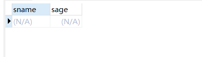
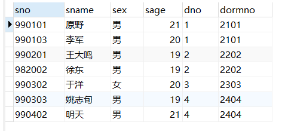
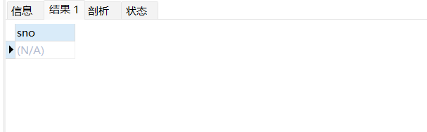
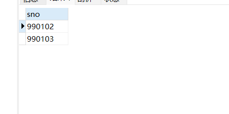
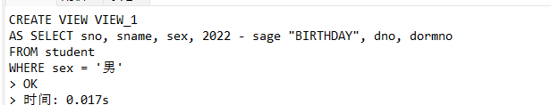
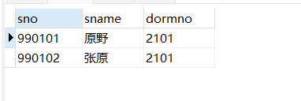

# 《数据库课程设计》实验报告

> 学号：2020118100  姓名：庞晓宇


## 一、实验名称
第3次实习作业


## 二、实验目的
20、查询其他系比‘计算机系’所有学生年龄大的学生姓名和年龄。

21、查询选修课程库没有不及格分数的学生。

22、查询至少选修了‘1’ 号和‘2’ 号课程的学生号码

23、查询至少选修了990102 ’学生的全部课程的学生学号。

24、查询‘1' 系的学生与年龄大于20岁的学生的差集。

25、查询选修“数据库原理”的学生与选修“ 高等数学”的学生的交集。

26、创建“计算机”系的所有男生的视图VIEW_1(要求反映出学生的出生年份)。

27、在视图VIEW_ 1中找出名字中有“原"字的学生的学号、姓名、宿舍号。

28、修改视图VIEW_ 1中的学生“李军”的年龄为23，宿舍号为“2202"。


## 三、实验内容
```sql
-- 20、查询其他系比‘计算机系’所有学生年龄大的学生姓名和年龄。
SELECT sname, sage
FROM student
WHERE sage > (
    SELECT MAX(sage)
    FROM student
    WHERE dno = '1'
);
```


```sql
-- 21、查询选修课程库没有不及格分数的学生。
SELECT *
FROM student
WHERE sno NOT IN (
    SELECT sno
    FROM grade
    WHERE score IS NULL OR score < 60
);
```


```sql
-- 22、查询至少选修了‘1’ 号和‘2’ 号课程的学生号码
SELECT sno
FROM grade
WHERE cno = '1'
INTERSECT
SELECT sno
FROM grade
WHERE cno = '2';

SELECT sno
FROM grade
WHERE cno = '1' AND sno IN (
    SELECT sno
    FROM grade
    WHERE cno = '2'
);
```


```sql
-- 23、查询至少选修了990102 ’学生的全部课程的学生学号。
SELECT DISTINCT sno
FROM grade gradex
WHERE NOT EXISTS (
    SELECT *
    FROM grade gradey
    WHERE gradey.sno = '990102' AND NOT EXISTS (
        SELECT *
        FROM grade gradez
        WHERE gradez.sno = gradex.sno AND gradez.cno = gradey.cno
    )
);
```


```sql
-- 24、查询‘1' 系的学生与年龄大于20岁的学生的差集。
SELECT *
FROM student
WHERE dno = '1'
EXCEPT
SELECT *
FROM student
WHERE sage > 20;
```

```sql
-- 25、查询选修“数据库原理”的学生与选修“ 高等数学”的学生的交集。
SELECT *
FROM grade
WHERE (
    SELECT cno
    FROM course
    WHERE cname = '数据库原理'
)
INTERSECT
SELECT *
FROM grade
WHERE (
    SELECT cno
    FROM course
    WHERE cname = '高等数学'
);
```

```sql
-- 26、创建“计算机”系的所有男生的视图VIEW_1(要求反映出学生的出生年份)。
CREATE VIEW VIEW_1
AS SELECT sno, sname, sex, 2022 - sage "BIRTHDAY", dno, dormno
FROM student
WHERE sex = '男';
```


```sql
-- 27、在视图VIEW_ 1中找出名字中有“原"字的学生的学号、姓名、宿舍号。
SELECT sno, sname, dormno
FROM VIEW_1
WHERE sname LIKE '%原%';
```


```sql
-- 28、修改视图VIEW_ 1中的学生“李军”的年龄为23，宿舍号为“2202"。
UPDATE VIEW_1
SET sage = 23 AND dormno = '2202'
WHERE sname = '李军';
```


## 四、实验最后的思考
通过本次实验，学习了嵌套查询、带有谓词的查询、不相关子查询、相关子查询以及集合查询。使用UPDATE修改表中的数据。
谓词IN EXISTS INTERSECT UNION EXCEPT的使用。
熟悉了SELECT语句完整的格式，聚集函数的一般形式，WHERE子句的条件表达式格式。
在MySQL中集合查询是不被支持的，应使用相关的替代方式。
