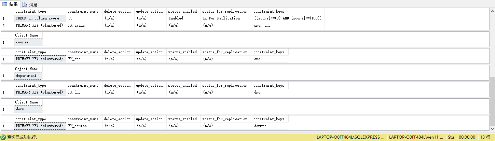

# 《数据库课程设计》实验报告

> 学号：2020118100  姓名：庞晓宇


## 一、实验名称
第6次实习作业  
**数据库完整性**


## 二、实验目的
1. 检查Stu数据库是否添加了所有的主码、外码
2. 给student表添加check约束:学生性别只能取‘男’或‘女’或 NULL;学生年龄在15-60之间（包含15和60
3. 给score表添加check 约束:成绩在0到100之间。
4. 验证


## 三、实验内容
1. 检查Stu数据库是否添加了所有的主码、外码
    ```sql
    EXEC sp_helpconstraint student;
    EXEC sp_helpconstraint grade;
    EXEC sp_helpconstraint course;
    EXEC sp_helpconstraint department;
    EXEC sp_helpconstraint dorm;
    ```
    
2. 给student表添加check约束:学生性别只能取‘男’或‘女’或 NULL;学生年龄在15-60之间（包含15和60)。
    ```sql
    ALTER TABLE student
    ADD CONSTRAINT CK_student_sex CHECK(sex IN('男', '女', NULL));
    ALTER TABLE student
    ADD CONSTRAINT CK_student_sage CHECK(
            sage BETWEEN 15 AND 60
        );
    ```
    
3. 给score表添加check 约束:成绩在0到100之间。
    ```sql
    ALTER TABLE grade
    ADD CONSTRAINT CK_grade_score CHECK(
            score BETWEEN 0 AND 100
        );
    ```
    
4. 验证
   1. 向student表插入('990101','原平,男',21,'1','2101')
        ```sql
        INSERT INTO student
        VALUES('990101', '原平', '男', 21, '1', '2101');
        ```
   2. 向student表插入(NULL,'原平,男',21,'1',2101')
        ```sql
        INSERT INTO student
        VALUES(NULL, '原平', '男', 21, '1', '2101');
        ```
        
   3. 向student表插入('990901','原平,男',121,1',2101')
        ```sql
        INSERT INTO student
        VALUES('990901', '原平', '男', 121, 1, '2101');
        ```
        
   4. 向student表插入('990901','原平';'M',21,'1',2101')
        ```sql
        INSERT INTO student
        VALUES('990901', '原平', 'M', 21, '1', '2101');
        ```
        
   5. 向student表插入('990901','原平,男',21,'1',2601')
        ```sql
        INSERT INTO student
        VALUES('990901', '原平', '男', 21, '1', '2601');
        ```
   6. 向student表插入('990101','原平,男',21,'1',2101')
        ```sql
        INSERT INTO student
        VALUES('990101', '原平', '男', 21, '1', '2101');
        ```
   7. 向score表插入('990101','08',85)
        ```sql
        INSERT INTO score
        VALUES('990101', '08', 85);
        ```
   8. 删除计算机系
        ```sql
        DELETE FROM department
        WHERE dname = '计算机系';
        ```
   9. 删除原野
        ```sql
        DELETE FROM student
        WHERE sname = '原野';
        ```
   10. 将'计算机系'的系号改为8
        ```sql
        UPDATE department
        SET dno = '8';
        ```


## 四、实验最后的思考
通过本次实验，了解了数据库参照完整性的相关操作，通过1. 检查Stu数据库是否添加了所有的主码、外码、2. 给student表添加check约束:学生性别只能取‘男’或‘女’或 NULL;学生年龄在15-60之间（包含15和60、3. 给score表添加check 约束:成绩在0到100之间。之后验证了相关的完整性检验。
但是由于实验采用的是无参照完整性的sql导入数据，所以在验证8-10的时候出现了运行成功的情况，但是在之后的级联查询中就导致了不完整数据的产生，数据完整性遭到了破坏，以此也体现出了参照完整性的重要性。
如果采用包含参照完整性的数据进行中操作，在删除计算机系的时候，因为主键department(dno)是student的外键(dno)。所以在删除计算机系的时候会提示错误或者引发级联删除将student表中的计算机系的学生删除，并且级联grade表中的学生删除。之后的代码也是这个道理。
<br><br><br><br>

### 课后题：
5.什么是数据库中的自主存取控制方法和强制存取控制方法？
- 自主存取控制方法：定义各个用户对不同数据对象的存取权限。当用户对数据库访问时首先检查用户的存取权限。防止不合法用户对数据库的存取。
- 强制存取控制方法：每一个数据对象被（强制地）标以一定的密级，每一个用户也被（强制地）授予某一个级别的许可证。系统规定只有具有某一许可证级别的用户才能存取某一个密级的数据对象。


7.请用SQL的 GRANT 和 REVOKE 语句(加上视图机制)完成以下授权定义或存取控制功能:
1. 用户王明对两个表有 SELECT 权力。
     ```sql
     GRANT SELECT ON 职工, 部门
     TO 王明;
     ```
2. 用户李勇对两个表有 INSERT 和 DELETE 权力。
     ```sql
     GRANT INSERT, DELETE ON 职工, 部门
     TO 李勇;
     ```
3. 每个职工只对自己的记录有 SELECT 权力。
     ```sql
     GRANT SELECT ON 职工
     WHEN USER()=NAME
     TO ALL;
     ```
4. 用户刘星对职工表有 SELECT 权力，对工资字段具有更新权力。
     ```sql
     GRANT SELECT, UPDATE(工资) ON 职工
     TO 刘星;
     ```
5. 用户张新具有修改这两个表的结构的权力。
     ```sql
     GRANT ALTER TABLE ON 职工, 部门
     TO 张新;
     ```
6. 用户周平具有对两个表所有权力（读，插，改，删数据），并具有给其他用户授权的权力。
     ```sql
     GRANT ALL PRIVILIGES ON 职工, 部门
     TO 周平
     WITH GRANT OPTION;
7. 用户杨兰具有从每个部门职工中 SELECT 最高工资、最低工资、平均工资的权力，他不能查看每个人的工资。
     ```sql
     CREATE VIEW 部门工资 AS
     SELECT 部门.名称, MAX(工资), MIN(工资), AVG(工资)
     FROM 职工, 部门
     WHERE 职工.部门号 = 部门.部门号
     GROUP BY 职工.部门号
     GRANT SELECT ON 部门工资
     TO 杨兰;
     ```


8.把习题 8 中 (1)-(7) 的每一种情况，撤销各用户所授予的权力
1. ```sql
   REVOKE SELECT ON 职工, 部门
   FROM 王明;
   ```
2. ```sql
   REVOKE INSERT, DELETE ON 职工, 部门
   FROM 李勇;
   ```
3. ```sql
   REOVKE SELECT ON 职工
   WHEN USER ( ) = NAME
   FROM ALI;
   ```
4. ```sql
   REVOKE SELECT, UPDATE ON 职工
   FROM 刘星;
   ```
5. ```sql
   REVOKE ALTER TABLE ON 职工, 部门
   FROM 张新;
   ```
6. ```sql
   REVOKE ALL PRIVILIGES ON 职工, 部门
   FROM 周平;
   ```
7. ```sql
   REVOKE SELECT ON 部门工资
   FROM 杨兰;
   DROP VIEW 部门工资;
   ```


10.举例说明强制存取控制机制是如何确定主体是否能存取客体的。
     
假设要对关系变量S进行MAC控制，为简化起见，假设要控制存取的数据单位是
元组，则每个元组标以密级，如下表所示：
| S#  | SNAME | STATUS | CITY   | CLASS |
| --- | ----- | ------ | ------ | ----- |
| S1  | Smith | 20     | London | 2     |
| S2  | Jones | 10     | Paris  | 3     |
| S3  | Clark | 20     | London | 4     |


假设用户U1和U2的许可证级别分别为3和2，则根据规则U1能查得元组S1和S2，可修改元组S2；而U2只能查得元组S1，只能修改元组S1。

这里假设系统的存取规则是：
1. 仅当主体的许可证级别大于或等于客体的密级时，该主体才能读取相应的客体；
2. 仅当主体的许可证级别小于或等于客体的密级时，该主体才能写相应的客体。