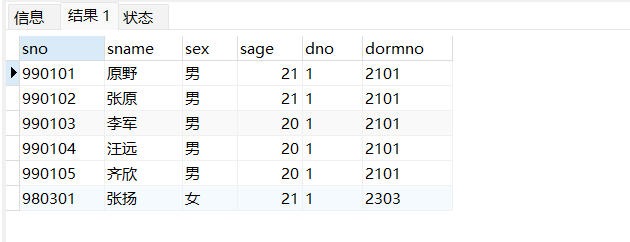
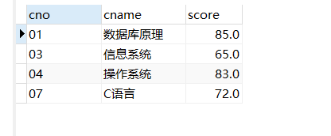
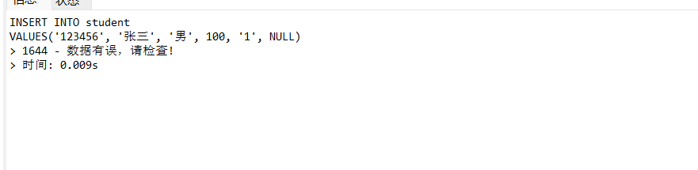
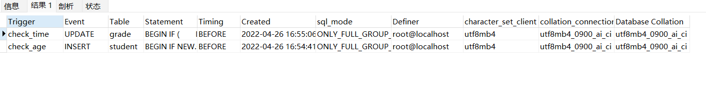

# 《数据库课程设计》实验报告

> 学号：2020118100  姓名：庞晓宇


## 一、实验名称
第7次实习作业


## 二、实验目的
作业八:存储过程  
1、建立查询“计算机系”同学基本信息的存储过程。  
2、建立给定同学学号，查询他所有相关课程和成绩的存储过程。

作业九:触发器  
1、如果student表有sage的约束，先删除约束，然后利用触发器实现:对student表中的年龄 SAGE在:18—28，否则提示“数据有误，请检查!”。  
2、对score表建立触发器，要求用户仅仅在周一至周五上午9点到下午17点之间，才能修改score表。


## 三、实验内容
1. 建立查询“计算机系”同学基本信息的存储过程。
    ```sql
    CREATE PROCEDURE `get_students_of_computer_science`() BEGIN
    SELECT *
    FROM student
    WHERE dno = (
            SELECT dno
            FROM department
            WHERE dname = '计算机系'
        );
    END;
    CALL get_students_of_computer_science();
    ```
    
2. 建立给定同学学号，查询他所有相关课程和成绩的存储过程。
    ```sql
    CREATE PROCEDURE `get_courses_and_scores_of_student`(IN sno VARCHAR(10)) BEGIN
    SELECT c.cno,
        c.cname,
        g.score
    FROM course c,
        grade g
    WHERE c.cno = g.cno
        AND g.sno = sno;
    END;
    CALL get_courses_and_scores_of_student('990101');
    ```
    
3. 如果student表有sage的约束，先删除约束，然后利用触发器实现:对student表中的年龄 SAGE在:18—28，否则提示“数据有误，请检查!”。
    ```sql
    -- ALTER TABLE student
    -- DROP CONSTRAINT IF EXISTS sage;
    CREATE TRIGGER `check_age` BEFORE
    INSERT ON student FOR EACH ROW BEGIN IF NEW.sage < 18
        OR NEW.sage > 28 THEN SIGNAL SQLSTATE '45000'
    SET MESSAGE_TEXT = '数据有误，请检查!';
    END IF;
    END;
    ```
    
4. 对score表建立触发器，要求用户仅仅在周一至周五上午9点到下午17点之间，才能修改score表。
    ```sql
    CREATE TRIGGER `check_time` BEFORE
    UPDATE ON grade FOR EACH ROW BEGIN IF (
            DAYOFWEEK(NOW()) <> 1
            AND DAYOFWEEK(NOW()) <> 2
            AND DAYOFWEEK(NOW()) <> 3
            AND DAYOFWEEK(NOW()) <> 4
            AND DAYOFWEEK(NOW()) <> 5
        )
        AND (
            HOUR(NOW()) < 9
            OR HOUR(NOW()) > 17
        ) THEN SIGNAL SQLSTATE '45000'
    SET MESSAGE_TEXT = '当前时间不允许修改!';
    END IF;
    END;
    SHOW TRIGGERS;
    DROP TRIGGER check_time;
    INSERT INTO student
    VALUES('123456', '张三', '男', 100, '1', NULL);
    ```
    


## 四、实验最后的思考
经过本次实验，初步了解了数据库处理过程和触发器的概念、创建、使用和删除。
建立了查询“计算机系”同学基本信息的存储过程。
建立给定同学学号，查询他所有相关课程和成绩的存储过程。
利用触发器实现了对student表中的年龄 SAGE在:18—28，否则提示“数据有误，请检查!”。
