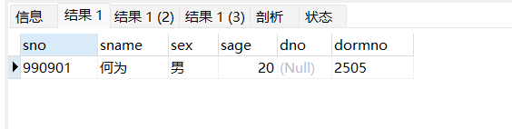
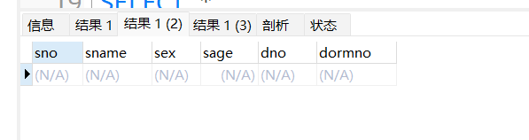
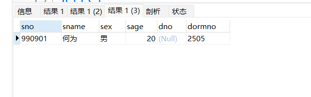

# 《数据库课程设计》实验报告

> 学号：2020118100  姓名：庞晓宇


## 一、实验名称
第8次实习作业


## 二、实验目的
熟悉事务的使用


## 三、实验内容
作业十：事务
编写事务控制程序，要求在事务中包含：在Stu数据库的student表中插入一条记录(990901，何为，男，20，NULL，2505)，并检索插入是否成功，然后设置一个保存点，紧接着执行删除刚才插入的数据，并检索删除是否成功，然后回滚事务，最后执行检索操作，看插入的数据是否存在。分析原因。

```sql
-- 如果存在先删除该储存过程
DROP PROCEDURE IF EXISTS transaction_insert_check_delete_rollback;
-- 创建事务transaction_insert_check_delete_rollback
CREATE PROCEDURE transaction_insert_check_delete_rollback() BEGIN START TRANSACTION;
-- 开始事务
-- 在 Stu数据库的student表中插入一条记录(990901，何为，男，20，NULL，2505)
INSERT INTO student
VALUES (990901, '何为', '男', 20, NULL, 2505);
-- 检索插入是否成功
SELECT *
FROM student
WHERE sno = 990901;
-- 设置一个保存点
SAVEPOINT sp1;
-- 删除刚才插入的数据
DELETE FROM student
WHERE sno = 990901;
-- 检索删除是否成功
SELECT *
FROM student
WHERE sno = 990901;
-- 回滚事务
ROLLBACK TO sp1;
-- 检索插入的数据
SELECT *
FROM student
WHERE sno = 990901;
END;
-- 调用存储过程
call transaction_insert_check_delete_rollback();
```


## 四、实验最后的思考
经过本次实验，了解、熟悉了数据库事务的创建和执行。

插入数据：

删除数据：

回滚：

回滚事务后，插入的数据还在。事务的开启会将autocommit置为0，更改操作不不会立刻提交。在执行插入操作后设置了保存点，删除数据后回滚到保存点，保存点的数据是未提交的插入后的表。再次执行检索操作的时候，插入的数据还在。在事务结束的时候，回滚删除操作后的执行结果将会被提交到数据库。在事务结束后检查数据库中，插入的数据也应该还在。
