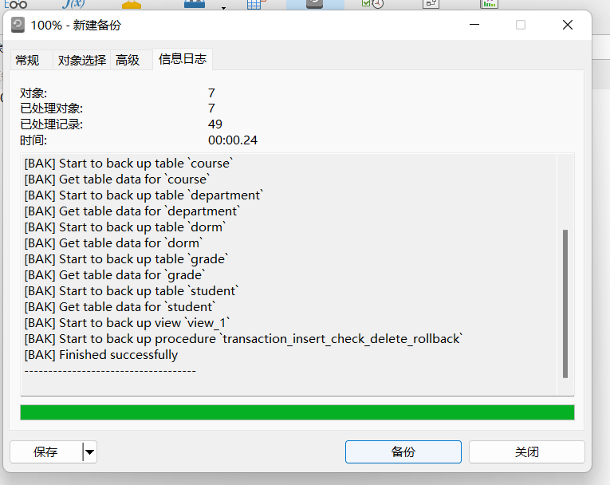
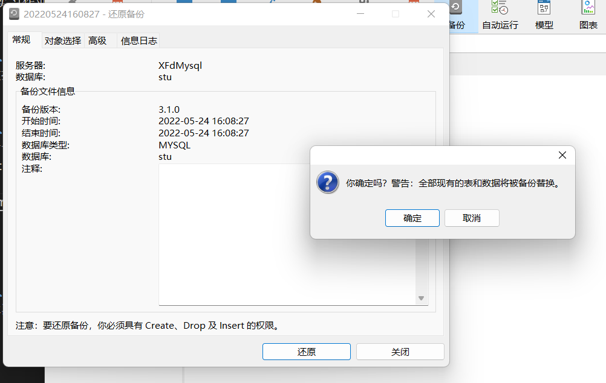
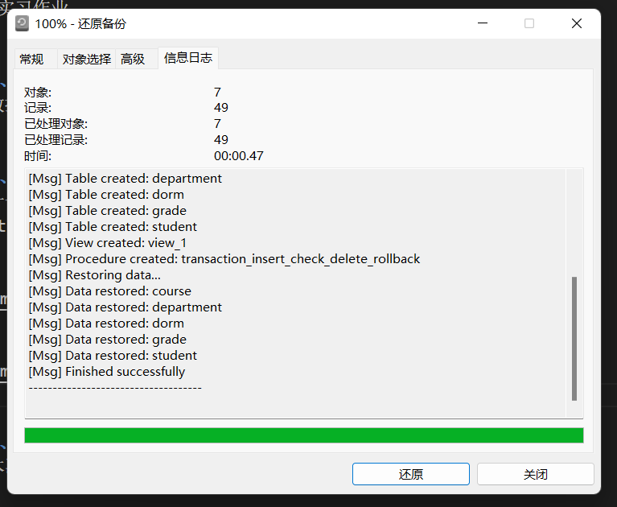

# 《数据库课程设计》实验报告

> 学号：2020118100  姓名：庞晓宇

## 一、实验名称
第9次实习作业

## 二、实验目的
熟悉数据库的备份与恢复

## 三、实验内容
作业十一：数据库的备份与恢复  
备份stu数据库并尝试恢复

备份：

还原：

## 四、实验最后的思考
经过本次实验，了解、熟悉了数据库的备份与恢复操作，并成功在Navicat中对MySQL数据库进行了备份与恢复。
